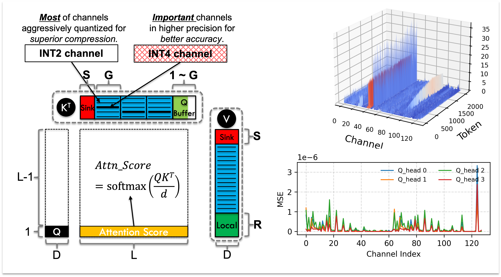

# Kitty
Kitty is a plug-and-play KV-cache system for HuggingFace Transformers, enabling accurate 2-bit KV-cache quantization.
We introduce Dynamic Channel-wise Precision Boost, a novel 2-bit quantization algorithm for KV cache, inspired by the key observations in channel-wise patterns
and channel-wise quantization sensitivity.

This repository is the official artifact of our conference submission (under review).


### Get the code:
```
git clone https://github.com/Summer-Summer/Kitty.git
cd Kitty
git submodule update --init --recursive
```

### Building .sif image for apptainer:
```
mkdir build
cd build
sudo apptainer build kitty.sif ../kitty_cuda121.def 
```

### Building .img (writable overlay image):
```
# Still in the build directory
apptainer overlay create --size 8192 kitty.img
```

### Installing software into the overlay image:
Entering the apptainer:
```
cd ..
apptainer exec --nv \
--bind /home/$USER:/workspace \
--overlay build/kitty.img build/kitty.sif bash
```

Installing the package:

**Important:** Before installation, we need to manually switch the submodules to the following branch：
- Transformers: `hf-4.53.2`
- lm_eval: `kitty`

```bash
# Install transformers
cd /workspace/Kitty/third_party/transformers
git checkout hf-4.53.2
# Use two-step installation to avoid cross-device link errors in overlay environment
pip install -e . --ignore-installed --no-deps
pip install -e .

# Install lm-evaluation-harness
cd /workspace/Kitty/third_party/lm-evaluation-harness
git checkout kitty
pip install -e .

# Install lm-eval with math support
pip install "lm-eval[math]"

# Install Kitty
cd /workspace/Kitty/
pip install -e .

# Install seaborn for visualization
pip install seaborn

# Install HQQ for HuggingFace's KV Cache quantization
pip install hqq
```


### Exit the Apptainer.
```
exit
```

### Run experiments

#### Before Running the experiments:
Entering the computing node (interactive mode):
```
srun --ntasks=1 \
		 --gres=gpu:8 \
		 --cpus-per-task=64 \
		 --mem=450000 \
		 --partition=batch \
     --job-name=debug \
     --pty /bin/bash
```

Entering the apptainer:
```bash
apptainer exec --nv \
--bind /home/$USER:/workspace \
--overlay build/kitty.img build/kitty.sif bash
```

**Note:** To run multiple instances, use read-only mode for the overlay:
```bash
apptainer exec --nv \
--bind /home/$USER:/workspace \
--overlay build/kitty.img:ro build/kitty.sif bash
```
The `:ro` flag allows multiple containers to share the same overlay image without conflicts.

#### Running latency benchmarking:
See more details in [latency_benchmarking](latency_benchmarking/).

#### Running accuracy simulation:
See more details in [accuracy_simulation](accuracy_simulation/).


## Citation

If you find Kitty useful or relevant to your research, please kindly cite [our paper](https://arxiv.org/abs/2511.18643):
```
@misc{xia2025kittyaccurateefficient2bit,
      title={Kitty: Accurate and Efficient 2-bit KV Cache Quantization with Dynamic Channel-wise Precision Boost}, 
      author={Haojun Xia and Xiaoxia Wu and Jisen Li and Robert Wu and Junxiong Wang and Jue Wang and Chenxi Li and Aman Singhal and Alay Dilipbhai Shah and Alpay Ariyak and Donglin Zhuang and Zhongzhu Zhou and Ben Athiwaratkun and Zhen Zheng and Shuaiwen Leon Song},
      year={2025},
      eprint={2511.18643},
      archivePrefix={arXiv},
      primaryClass={cs.LG},
      url={https://arxiv.org/abs/2511.18643}, 
}
```